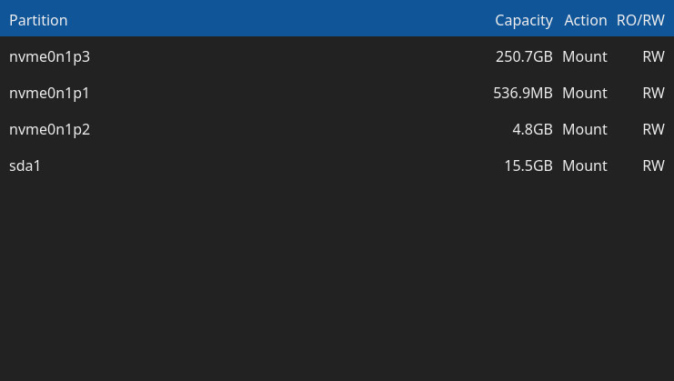
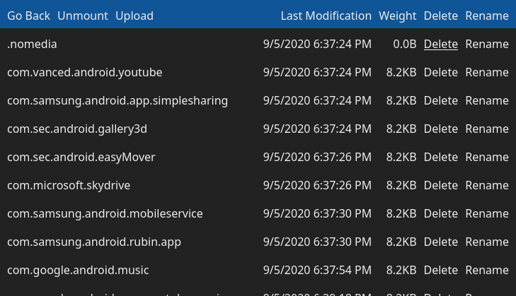

# rc-storage

Web interface to mount and browse storage partitions.
It requires partitions to have a node in /dev.

To do:

- allow specification of mount directory in command line arguments
- allow specification of address to bind the server to
- make interface mobile-friendly
- remove the requirement for root access to mount
- show filesystem type in partition list (low priority)

